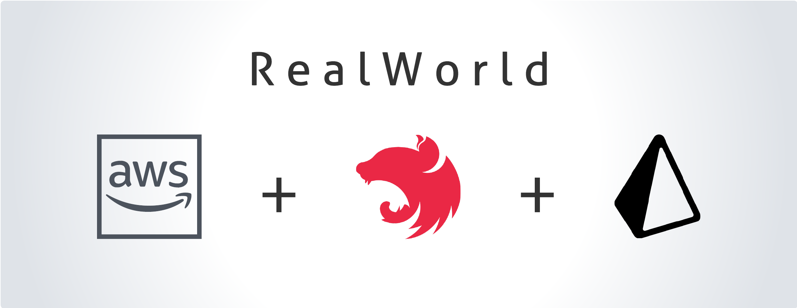
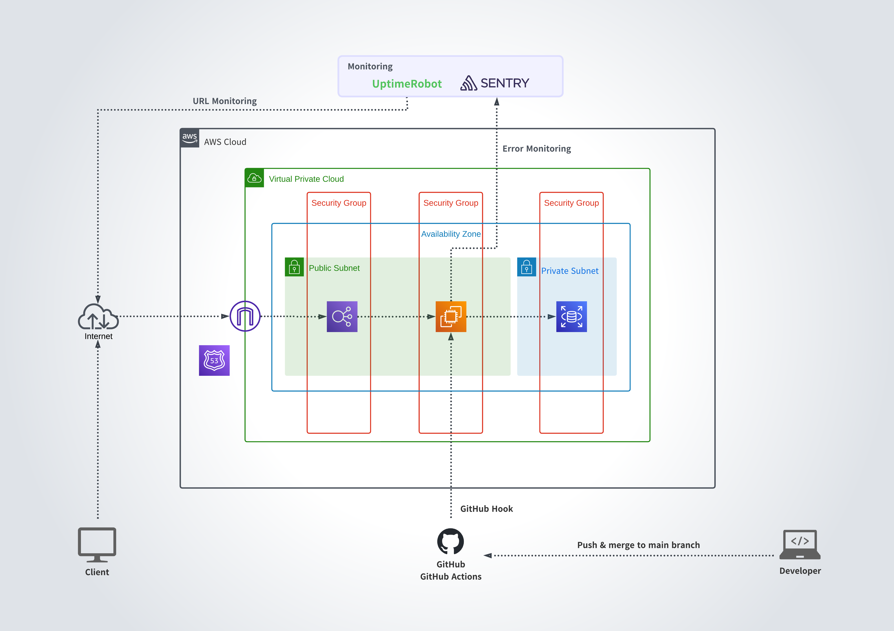

## 概要
RealWorldのAPIをNestJSとPrismaで実装しAWSにデプロイしました。  
RealWorldは以下のような機能を持つシンプルなブログアプリケーションです。  

- ユーザー登録/ログイン/ログアウト
- 記事の作成・閲覧・編集・削除
- 記事リスト表示（ページネーション、フィルタリング、ソート機能付き）
- 記事へのコメント作成・閲覧・編集・削除
- ユーザープロフィール閲覧・編集

[参考URL：RealWorld Introduction](https://realworld-docs.netlify.app/docs/intro)  

本アプリケーションでは「ユーザー登録/ログイン/記事の作成・閲覧・編集・削除」を実装しました。

## 使用技術
| Category          | Technology Stack                       |
| ----------------- | ------------------------------------   |
| Backend           | TypeScript, NestJS, Prisma             |
| Infrastructure    | Amazon Web Services                    |
| Database          | MySQL                                  |
| Monitoring        | Sentry, UptimeRobot                    |
| Environment setup | Docker                                 |
| CI/CD             | GitHub Actions                         |
| etc.              | ESLint, Prettier, Jest, Git, GitHub    |

## APIのURL
以下が実装したAPIのURLです。

- POST / https://realworld.ren-app.jp/api/users
- POST / https://realworld.ren-app.jp/api/users/login
- POST / https://realworld.ren-app.jp/api/articles
- GET / https://realworld.ren-app.jp/api/articles/[slug]
- PUT / https://realworld.ren-app.jp/api/articles/[slug]
- DELET / https://realworld.ren-app.jp/api/articles/[slug]

## インフラ構成図

